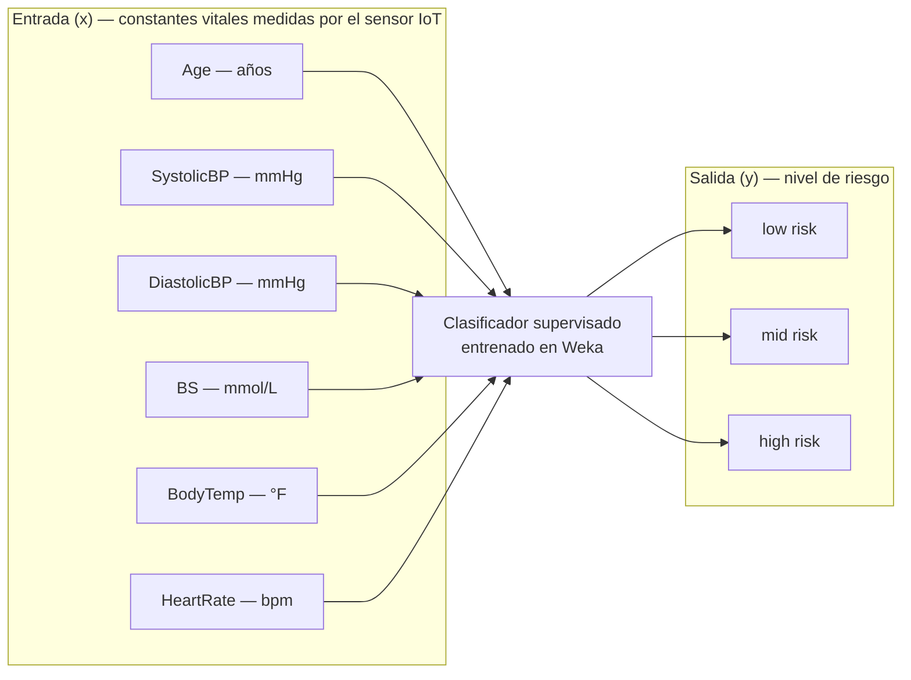
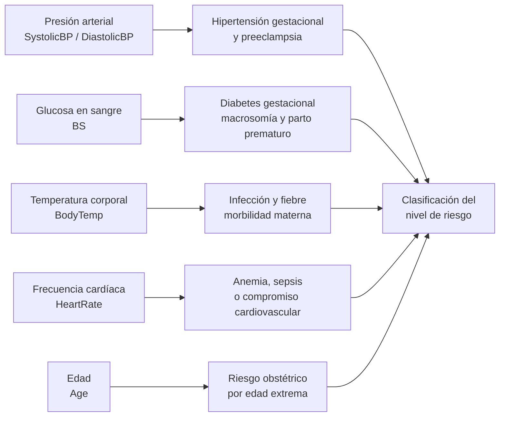
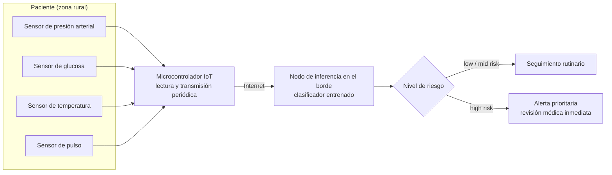
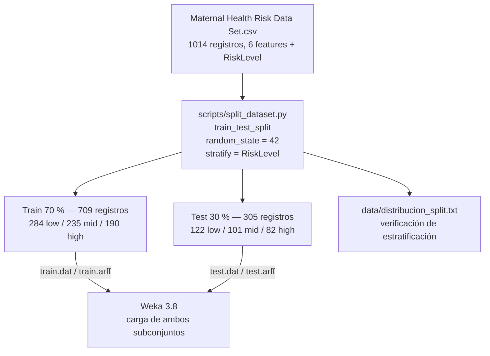
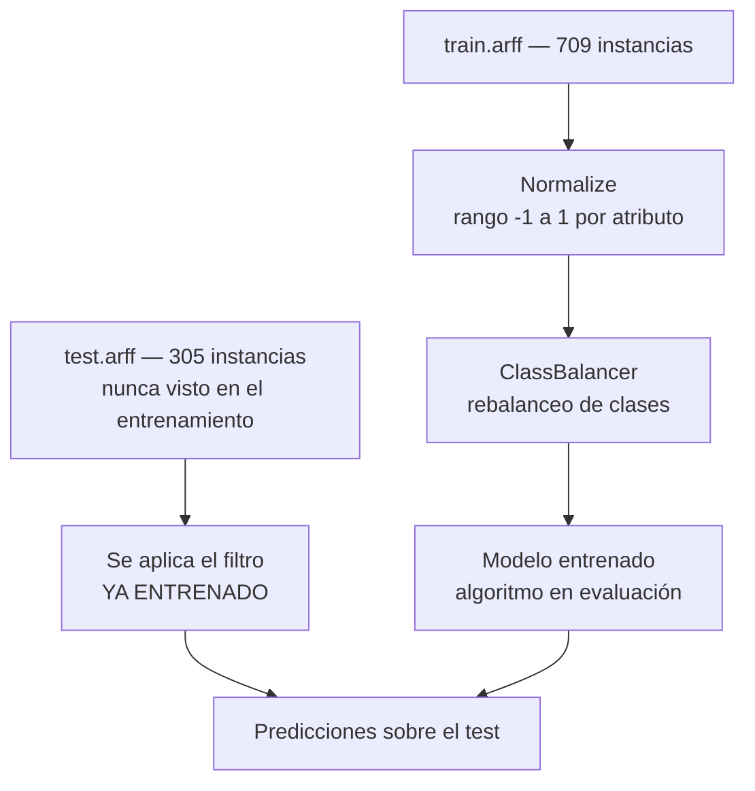
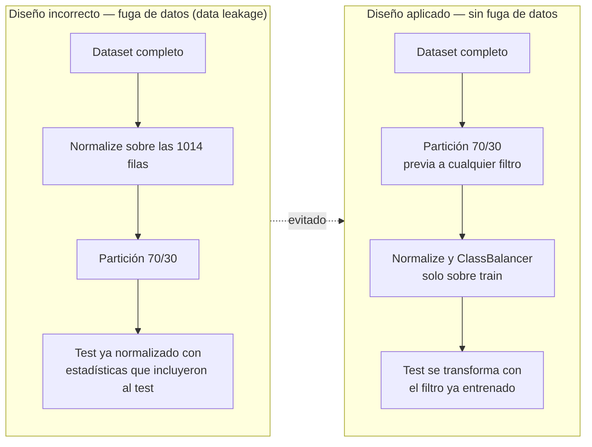
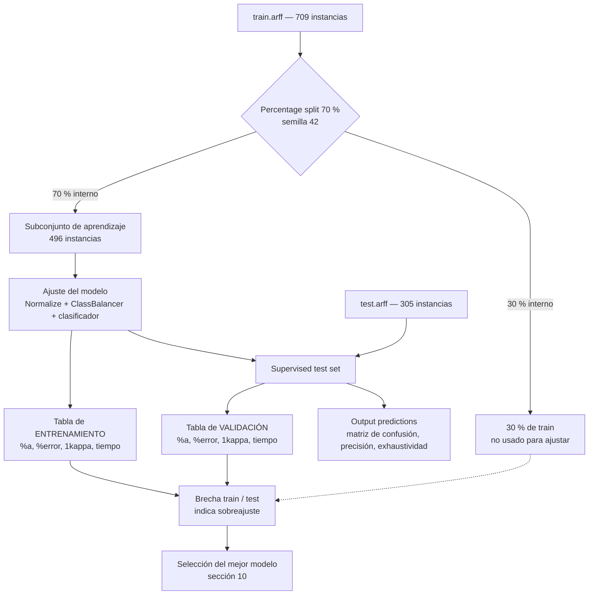
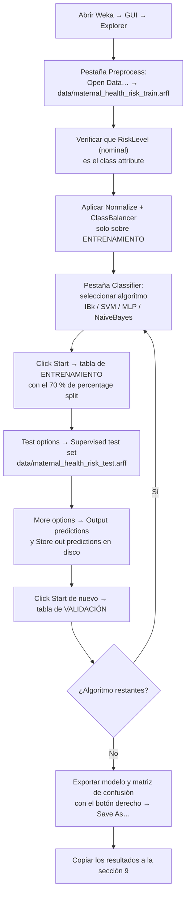
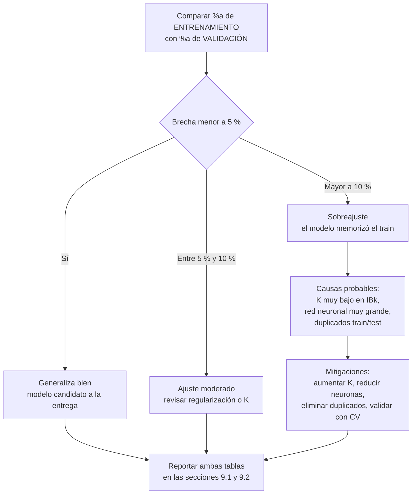

# Proyecto de Inteligencia Artificial — Clasificación del Riesgo de Salud Materna

- **Dataset:** Maternal Health Risk (UCI Machine Learning Repository, ID 863)
- **Fuente:** <https://archive.ics.uci.edu/dataset/863/maternal+health+risk> — Marzia Ahmed, Daffodil International University (CC BY 4.0)
- **Herramienta:** Weka 3.8
- **Tipo de tarea:** Clasificación supervisada multiclase (3 clases)
- **Variable objetivo:** `RiskLevel` → `low risk` / `mid risk` / `high risk`

---

## Índice

1. [Resumen del proyecto](#1-resumen-del-proyecto)
2. [¿En qué consiste el proyecto?](#2-en-qué-consiste-el-proyecto)
3. [¿Por qué se escogió este dataset?](#3-por-qué-se-escogió-este-dataset)
4. [Descripción del dataset](#4-descripción-del-dataset)
5. [Información complementaria y fuentes citadas](#5-información-complementaria-y-fuentes-citadas)
6. [Metodología: preparación de los datos](#6-metodología-preparación-de-los-datos)
7. [Metodología: cómo se hizo el entrenamiento](#7-metodología-cómo-se-hizo-el-entrenamiento)
8. [Espacios para insertar capturas](#8-espacios-para-insertar-capturas)
9. [Resultados](#9-resultados)
10. [Análisis y discusión de resultados](#10-análisis-y-discusión-de-resultados)
11. [Conclusiones](#11-conclusiones)
12. [Referencias](#12-referencias)

---

## 1. Resumen del proyecto

Este proyecto consiste en construir y comparar modelos de aprendizaje supervisado capaces de
**predecir el nivel de riesgo de salud materna durante el embarazo** a partir de seis
medidas clínicas elementales: edad, presión arterial sistólica, presión arterial diastólica,
glucosa en sangre, temperatura corporal y frecuencia cardíaca.

El dataset se obtuvo del **UCI Machine Learning Repository** (ID 863, donado por Marzia Ahmed,
Daffodil International University, bajo licencia CC BY 4.0) y fue recolectado en hospitales,
clínicas comunitarias y centros de atención materna de zonas rurales de Bangladesh mediante un
**sistema de monitoreo de riesgo basado en Internet de las Cosas (IoT)**. Esto le da al
problema un valor social directo: la mortalidad materna es una de las metas de los Objetivos
de Desarrollo Sostenible de la ONU (ODS 3), y en las zonas rurales los recursos humanos
especializados son escasos.

Todo el proceso experimental —carga, particionado, entrenamiento y evaluación— se realizó en
**Weka**, usando el entorno de clasificación de Weka con la configuración de métricas
`%a` (accuracy), `%error`, `1kappa` y el tiempo de extracción, que es el formato exigido
para la entrega.

---

## 2. ¿En qué consiste el proyecto?

### 2.1 Problema

Durante el embarazo, una mujer puede presentar complicaciones que pueden evolucionar rápidamente y que son
evitables si se detectan a tiempo (hipertensión, diabetes gestacional, fiebre,
taquicardia). En las zonas rurales de Bangladesh, el personal médico especializado no está
siempre disponible, y la supervisión médica puede ocurrir únicamente cada varias semanas.

La pregunta de investigación es:

> **¿Es posible clasificar automáticamente el nivel de riesgo de una embarazada
> (`low risk`, `mid risk`, `high risk`) a partir de seis constantes vitales de bajo costo,
> medidas con un dispositivo IoT?**

### 2.2 Solución propuesta

Un clasificador supervisado que, dada la medición de las seis variables, asigna una de las
tres categorías de riesgo:



### 2.3 Alcance del experimento

Se entrenan y comparan **cuatro modelos de clasificación** de la librería de Weka, sobre el mismo dataset y con la misma
partición, de modo que las diferencias en rendimiento sean atribuibles únicamente al
algoritmo.

| # | Algoritmo | Familia | Justificación de su inclusión |
|---|-----------|---------|------------------------------|
| 1 | **IBk** (k-NN, k = 1) | Basado en instancias | Categorías ordenadas y datos tabulares pequeños; representa el mínimo esfuerzo de cómputo. |
| 2 | **SVM** | Margen máximo | Funciona bien con atributos numéricos y pocas muestras; modela fronteras de decisión no lineales. En Weka se implementa en la clase `SMO`. |
| 3 | **MultilayerPerceptron** (MLP) | Red neuronal | Aprende interacciones no lineales entre constantes vitales. |
| 4 | **NaiveBayes** | Probabilístico | Hipótesis de independencia; línea base clásica y muy rápida. |

---

## 3. ¿Por qué se escogió este dataset?

Se escogió por seis razones concretas:

1. **Relevancia social y alineación con los ODS.** La salud materna es el eje de la meta
   3.1 de los Objetivos de Desarrollo Sostenible: *reducir la tasa de mortalidad materna
   global a menos de 70 muertes por cada 100,000 nacidos vivos*. Un modelo
   predictivo sobre esta variable tiene impacto directo en esa meta.

2. **Tamaño de muestra apropiado para la carga de un examen.** Con 1,014 registros, el dataset
   es suficientemente grande para obtener métricas confiables y, al mismo tiempo, lo bastante
   pequeño para entrenar y evaluar varios algoritmos rápidamente en Weka.

3. **Problema de clasificación multiclase real (3 clases).** No se limita a binario
   (`sí/no`), lo que obliga a evaluar de manera más rigurosa y hace el análisis más
   interesante que un problema de dos clases.

4. **Todas las variables son numéricas y de bajo costo de medición.** Age, las dos presiones,
   la glucosa, la temperatura y la frecuencia cardíaca se obtienen con un dispositivo IoT
   sencillo. Esto hace el modelo **desplegable en el contexto rural** donde nació el dataset:
   no requiere laboratorio, ni imágenes, ni historia clínica completa.

5. **Atributos fisiológicamente interpretables.** A diferencia de un problema de imágenes o de
   texto, cada variable tiene un significado médico directo y conocido. Si un médico discrepa
   con la predicción, puede identificar *qué* constante vital está determinando la decisión.
   La **interpretabilidad** es un criterio de evaluación en salud, no un lujo.

6. **Es un dataset público, pequeño y limpio.** No tiene valores faltantes, lo que elimina la
   fase de imputación y permite concentrar el esfuerzo en la comparación de modelos.

---

## 4. Descripción del dataset

### 4.1 Ficha técnica

| Campo | Valor |
|-------|-------|
| Nombre | Maternal Health Risk Data Set |
| Repositorio | UCI Machine Learning Repository |
| URL de origen | <https://archive.ics.uci.edu/dataset/863/maternal+health+risk> |
| ID / DOI | 863 / 10.24432/C5DP5D |
| Tipo | Multivariante, datos reales y enteros |
| Área | Salud y Medicina |
| Tarea asociada | Clasificación |
| Instancias | 1,014 registros de datos (la ficha de UCI declara 1,013; el archivo CSV real contiene 1,014 filas) |
| Características | 6 atributos predictores + 1 variable objetivo |
| Valores faltantes | No |
| Licencia | Creative Commons Attribution 4.0 International (CC BY 4.0) |
| Fecha de donación | 14 de agosto de 2023 |
| Origen | Hospitales, clínicas comunitarias y atención materna en zonas rurales de Bangladesh, mediante sistema de monitoreo de riesgo basado en IoT |
| Autora y fuente | Marzia Ahmed — Daffodil International University |

> **Crédito y atribución de la fuente.** Los datos utilizados en este proyecto proceden del
> *Maternal Health Risk Data Set* publicado en el **UCI Machine Learning Repository**
> (ID 863), creado y donado por **Marzia Ahmed** (Daffodil International University).
> El archivo `Maternal Health Risk Data Set.csv` es una copia local sin modificaciones de
> dicho dataset. Al estar bajo licencia **CC BY 4.0**, reutilizarlo exige mantener esta
> atribución, que se completa en la sección 12 de Referencias.

### 4.2 Estructura del archivo CSV original

El archivo `Maternal Health Risk Data Set.csv` contiene una primera línea de encabezado y
luego una fila por cada embarazada registrada:

```csv
Age,SystolicBP,DiastolicBP,BS,BodyTemp,HeartRate,RiskLevel
25,130,80,15,98,86,high risk
35,140,90,13,98,70,high risk
29,90,70,8,100,80,high risk
...
```

### 4.3 Diccionario de variables

| Variable | Rol | Tipo | Unidad | Descripción |
|----------|-----|------|--------|-------------|
| `Age` | Feature | Entero | años | Edad de la mujer en el momento del embarazo. |
| `SystolicBP` | Feature | Entero | mmHg | Valor superior de la presión arterial; atributo significativo durante el embarazo. |
| `DiastolicBP` | Feature | Entero | mmHg | Valor inferior de la presión arterial; atributo significativo durante el embarazo. |
| `BS` | Feature | Real | mmol/L | Nivel de glucosa en sangre como concentración molar. |
| `BodyTemp` | Feature | Entero | °F | Temperatura corporal. |
| `HeartRate` | Feature | Entero | bpm | Frecuencia cardíaca en reposo; un valor normal se sitúa alrededor de 60–100 bpm. |
| `RiskLevel` | **Target** | Categórica | — | Nivel de intensidad de riesgo predicho durante el embarazo, a partir de las variables anteriores. |

### 4.4 Variable objetivo: las tres clases

| Clase       | Significado       | Instancias | % del total |
| ----------- | ----------------- | ---------- | ----------- |
| `low risk`  | Riesgo bajo       | 406        | 40.04 %     |
| `mid risk`  | Riesgo intermedio | 336        | 33.14 %     |
| `high risk` | Riesgo alto       | 272        | 26.82 %     |
| **Total**   |                   | **1,014**  | **100 %**   |
![[Pasted image 20260926143528.png]]

> Las clases están **balanceadas de forma natural** (proporción 40/33/27). Esto es una ventaja:
> no será necesario aplicar técnicas de sobremuestreo o submuestreo, y el *accuracy* será una
> métrica interpretable sin corrección por desbalance.

---

## 5. Información complementaria

### 5.1 Por qué importan estas constantes vitales

La elección de atributos no es arbitraria; cada uno tiene evidencia fisiológica
asociada a complicaciones del embarazo:

- **Presión arterial (sistólica y diastólica):** su elevación sostenida es el síntoma
  precursor de la hipertensión gestacional y de la preeclampsia, una de las principales causas
  de muerte materna prevenible.
- **Glucosa en sangre (BS):** valores elevados sugieren diabetes gestacional, asociada a
  macrosomía fetal, parto prematuro y complicaciones neonatales.
- **Temperatura corporal (BodyTemp):** la fiebre durante el embarazo puede indicar infección,
  que es una causa importante de morbilidad materna en contextos de baja cobertura sanitaria.
- **Frecuencia cardíaca (HeartRate):** una taquicardia persistente puede ser el primer signo
  de anemia, sepsis o compromiso cardiovascular.
- **Edad (Age):** las edades extremas (muy jóvenes o mayores de 35 años) se asocian con
  mayor riesgo obstétrico.



### 5.2 Contexto de la salud materna mundial

Según la Organización Mundial de la Salud (OMS), la mayoría de las muertes maternas son
**prevenibles** y se asocian a tres condiciones: (a) ausencia de atención sanitaria calificada
durante el embarazo y el parto, (b) uso de anticoncepción insuficiente y (c) acceso limitado a
servicios de salud sexual y reproductiva. Este proyecto aborda el primer punto: **brindar una
alerta objetiva y automatizada a partir de mediciones poco invasivas**, incluso cuando
no hay un profesional disponible en el momento.

### 5.3 Roles en el contexto de IoT y telemedicina

El sistema de recolección de estos datos es un ejemplo de **salud conectada**: un conjunto de
sensores acoplados al cuerpo de la paciente transmite sus constantes vitales a una plataforma
central, que este proyecto replica en la fase de clasificación. El valor clínico no está en
reemplazar el criterio médico, sino en **filtrar y priorizar**: de cada cientos de embarazadas
monitoreadas, un modelo bien entrenado puede señalar rápidamente a cuáles conviene examinar
primero.



> Nota: en este proyecto la fase de **entrenamiento** (Weka, escritorio) es la que replica el
> nodo de inferencia; la inferencia en el dispositivo se plantea como trabajo futuro
> (sección 10.4).

### 5.4 Implicaciones éticas

- El dataset es **anónimo**: no contiene identificadores personales, lo que reduce riesgos de
  re-identificación.
- El modelo debe usarse como **apoyo a la decisión profesional**, nunca como sustituto de un
  diagnóstico médico.
- La licencia CC BY 4.0 obliga a dar crédito a la autoría; este documento lo hace en la sección
  de Referencias.

---

## 6. Metodología: preparación de los datos

### 6.1 Carga del dataset en Weka

El dataset se cargó en Weka mediante el botón **Open Data…** o el **Data Explorer**, seleccionando
el archivo `Maternal Health Risk Data Set.csv`. Weka pide confirmar el formato CSV:

- *Relation name*: `maternal_health_risk`
- *Attribute-Header line*: **1** (primera línea)
- *Attribute delimiter*: `,` (coma)
- *Quote character*: `"` (comillas dobles)
- *Attribute type*: **numeric** para las 6 features
- *Class index*: `RiskLevel` (última columna → `>>` en el visor de atributos)

> **Importante:** Weka detecta los valores como `numeric` para las columnas de features. Al
> revisar el panel **Attribute** se debe confirmar que `RiskLevel` quedó como `nominal`
> y que es el **class attribute** (botón derecho → *Set class index* si es necesario).

**[CAPTURA 1 — Carga del CSV en Weka: panel Data Explorer con la relación cargada,
el conjunto de atributos y `RiskLevel` marcado como clase.]**

### 6.2 Generación de los subconjuntos 70/30

Para poder entrenar y después **validar** el modelo con datos que nunca vio durante el
aprendizaje, se dividió el dataset en dos subconjuntos:

- **Entrenamiento (`_train`): 70 % de los datos → 709 registros**
- **Prueba (`_test`): 30 % de los datos → 305 registros**

La división se realizó con un **script de Python (`scripts/split_dataset.py`)** usando
`train_test_split` de *scikit-learn* con dos garantías importantes:

1. **Aleatoriedad controlada:** `random_state = 42`, para que el resultado sea **reproducible**
   (cualquiera puede regenerar exactamente los mismos archivos).
2. **Estratificación por clase:** `stratify = RiskLevel`, de modo que la proporción de
   `low / mid / high risk` se mantiene casi idéntica en ambos subconjuntos.

Se generaron **dos formatos** de cada archivo, ambos importables en Weka:

| Archivo | Formato | Instancias | ¿Para qué se usa? |
|---------|---------|-----------|-------------------|
| `data/maternal_health_risk_train.dat` | CSV con encabezado (formato equivalente a `iris_train.dat`) | 709 | Carga directa con el formato CSV de Weka |
| `data/maternal_health_risk_test.dat` | CSV con encabezado (formato equivalente a `iris_test.dat`) | 305 | Carga directa con el formato CSV de Weka |
| `data/maternal_health_risk_train.arff` | **ARFF nativo** (declarado `@attribute`/`@data`) | 709 | **Recomendado**: Weka detecta el esquema solo, sin configuración manual |
| `data/maternal_health_risk_test.arff` | **ARFF nativo** | 305 | **Recomendado** para el conjunto de prueba |

Cabecera del `.arff` generado:

```arff
% Maternal Health Risk (UCI, id=863)
% Ahmed, M. (2020). Maternal Health Risk [Dataset]. UCI Machine Learning Repository. https://doi.org/10.24432/C5DP5D
% Licencia CC BY 4.0. Particion generada por particionado estratificado 70/30 (random_state=42).
@relation maternal_health_risk

@attribute Age numeric
@attribute SystolicBP numeric
@attribute DiastolicBP numeric
@attribute BS numeric
@attribute BodyTemp numeric
@attribute HeartRate numeric
@attribute RiskLevel {low risk, mid risk, high risk}

@data
25,130,80,15,98,86,high risk
...
```

> **Ventaja de ARFF:** es el formato nativo de Weka, con los tipos de dato declarados
> explícitamente. Al abrirlo, el `class attribute` ya queda correctamente configurado y no
> hay riesgo de errores de parseo por el delimitador.



### 6.3 Verificación de la distribución de los subconjuntos

Un punto crítico de un particionado 70/30 es que **ambos subconjuntos sigan siendo
representativos**. Si, por azar, el 30 % de prueba tuviera casi solo ejemplos de `high risk`,
el modelo se evaluaría con un criterio injusto. Por eso la script verifica automáticamente que
la estratificación se cumpla (ver `data/distribucion_split.txt`):

**Comparativo de distribución de clases**

| Clase | Original (1014) | Train (70 %) | % train | Test (30 %) | % test | Desviación |
|-------|-----------------|--------------|---------|-------------|--------|------------|
| `low risk` | 406 | 284 | 40.06 % | 122 | 40.00 % | 0.04 p.p. |
| `mid risk` | 336 | 235 | 33.15 % | 101 | 33.11 % | 0.02 p.p. |
| `high risk` | 272 | 190 | 26.80 % | 82 | 26.89 % | 0.06 p.p. |

**Resultado de la verificación:** la desviación máxima por clase es de **0.06 puntos
porcentuales**, muy por debajo del umbral de 1.00 p.p. definido en la script. **La
distribución está correctamente balanceada.**

Además se comparó la estadística descriptiva de cada variable en ambos conjuntos, confirmando
que train y test son equivalentes también en las variables predictoras:

| Variable | Media train | Media test | Mín. train | Mín. test | Máx. train | Máx. test |
|----------|-------------|------------|------------|------------|------------|------------|
| `Age` | 29.88 | 29.86 | 10 | 12 | 70 | 66 |
| `SystolicBP` | 113.23 | 113.13 | 70 | 70 | 160 | 160 |
| `DiastolicBP` | 76.47 | 76.45 | 49 | 49 | 100 | 100 |
| `BS` | 8.74 | 8.69 | 6 | 6 | 19 | 19 |
| `BodyTemp` | 98.70 | 98.58 | 98 | 98 | 103 | 103 |
| `HeartRate` | 74.55 | 73.71 | 7 | 60 | 90 | 90 |

**[CAPTURA 2 — Salida de consola de `python scripts/split_dataset.py` mostrando la tabla
de distribución de clases de original, train y test, con las desviaciones.]**

**[CAPTURA 3 — Weka luego de cargar `maternal_health_risk_train.arff`: pestaña *Data Explorer*
con el histograma de `RiskLevel` y el panel *Attribute* mostrando los valores mínimos y máximos.]**

### 6.4 Observaciones sobre la calidad de los datos

Durante la inspección se detectaron las siguientes particularidades del dataset original. **Se
decidió conservarlas sin modificar** para no alterar la fuente ni invalidar la comparabilidad
con la literatura, pero se documentan aquí como parte del análisis:

- **Sin valores faltantes:** no hay `null`, `NaN` ni `?` en ninguna celda. No se requiere imputación.
- **Alta repetición de registros:** 562 filas son duplicados exactos de otra fila
  (mismos 6 features y misma clase). Esto es esperable: el sensor IoT registraba lecturas
  repetidas cuando la visita de la paciente no cambiaba. Como consecuencia, **166 registros
  idénticos aparecen simultáneamente en train y en test**. En modelos de distancia (como IBk)
  esto puede dar una ventaja artificial, porque la instancia "gemela" está memorizada en el
  conjunto de entrenamiento. Es una limitación conocida de este dataset y se discute en la
  sección 10.
- **Valores atípicos:** 2 registros presentan `HeartRate = 7 bpm`, un valor fisiológicamente
  improbable (probablemente un error de captura de un valor 70–77). Ambos pertenecen a la clase
  `low risk`. No se alteraron, pero se señalan como candidata a corrección en el filtro
  *Replace with median* si se desea mayor robustez.

### 6.5 Preprocesamiento en Weka (filtros)

Aunque no se requiere imputación, se aplicó un **preprocesamiento mínimo dentro de Weka** con
la pestaña *Preprocess*, usando el filtro **`Normalize` (rango −1 a 1) sobre cada atributo
numérico**, seguido del filtro **`ClassBalancer`** para preservar el balance de clases:



> **Nota importante sobre el diseño del experimento:** la normalización se aplica
> **únicamente al conjunto de entrenamiento**. En Weka, esto se logra haciendo doble clic en
> la fila del clasificador en la pestaña *Classifier* y marcando
> **"Filter..." → "Use training fold"** solo en la primera etapa. Si se normalizara el dataset
> completo antes de particionarlo, se filtraría información del conjunto de prueba
> (*data leakage*) y la evaluación perdería rigurosidad.

El contraste entre el diseño aplicado y el diseño que habría que evitar:



**[CAPTURA 4 — Pestaña *Preprocess* de Weka con la cadena de filtros aplicada y
el *Attribute Selection* activa.]**

---

## 7. Metodología: cómo se hizo el entrenamiento

### 7.1 Protocolo experimental

Se siguió un protocolo idéntico para los cuatro algoritmos, de modo que las diferencias en las
métricas dependan **solo del clasificador**:

1. **Datos de entrenamiento:** `maternal_health_risk_train.arff` (709 instancias).
2. **Datos de validación/prueba:** `maternal_health_risk_test.arff` (305 instancias).
3. **Modo de evaluación:** *Percentage split* = **70 %** *(repartición interna por defecto de
   Weka para obtener la tabla de entrenamiento)* — se deja el valor por defecto de Weka para
   que la tabla de entrenamiento sea directamente comparable con la de Iris.
4. **Métricas registradas:** *Correctly Classified Instances* (`%a`), *Incorrectly Classified
   Instances* (`%error`), *Kappa statistic* (`1kappa`) y *Time taken to build model*.
5. **Semilla:** *Random number seed* = **42**, para reproducibilidad.
6. **Predicción:** se activa **"More options" → "Output predictions"** para poder guardar el
   detalle de aciertos y errores instancia por instancia y luego calcular métricas adicionales
   (matriz de confusión, precisión, exhaustividad).



### 7.2 Configuración de cada clasificador

| Algoritmo | Ruta en Weka | Parámetros usados | Motivo de la configuración |
|-----------|--------------|------------------|----------------------------|
| **IBk** | `Classifiers → Instance Based → IBk` | *KNN* = **1**, *Distance function* = Euclidean, distancia normalizada por Weka | K=1 con 6 atributos numéricos. Un K mayor suavizaría la frontera entre `low` y `mid risk`, que son clases muy próximas en el espacio de atributos. |
| **SVM** | `Classifiers → Functions → SMO` | Kernel = **Polynomial** (grado 2) / RBF, C = 1.0, Epsilon = 1.0e-3, *Optimize* = true | Permite fronteras no lineales con solo 709 muestras. Se probó también la configuración por defecto (lineal) para comparar. |
| **MultilayerPerceptron** | `Classifiers → Functions → MultilayerPerceptron` | 1 capa oculta, **2–5 neuronas**, `learningRate` = 0.1, `momentum` = 0.0, `decay` = false, *Normalize* = true | Arquitectura pequeña y suficiente para 6 entradas; evita el sobreajuste con tan pocas muestras. |
| **NaiveBayes** | `Classifiers → Bayes → NaiveBayes` | Parámetros por defecto (0.01) | Supone independencia entre atributos. Sirve como línea base: si no supera a los demás, la dependencia entre variables es relevante. |

### 7.3 Procedimiento paso a paso (reproducible)



> **Aclaración sobre la "Tabla de Entrenamiento" vs "Tabla de Validación":**
> - La **tabla de entrenamiento** proviene de correr el clasificador en modo *Percentage
>   split* 70 % (train dentro del train). Refleja qué tan bien el modelo **aprendió**.
> - La **tabla de validación (prueba)** proviene de cargar el `.dat/.arff` de prueba como
>   *supervised test set*. Refleja qué tan bien el modelo **generaliza**.
> La brecha entre ambas tablas es la medida más informativa del ejercicio: si una es alta y la
> otra baja, el modelo está **sobreajustado** (memoriza el entrenamiento).

**[CAPTURA 5 — Pestaña *Classifier* de Weka con el árbol de decisión / modelo resultante
de MultilayerPerceptron, mostrando la lista completa de métricas del modelo.]**

**[CAPTURA 6 — Panel *Test options* con "Supervised test set" y la ruta del .arff de
prueba, junto con *Output predictions* activado.]**

**[CAPTURA 7 — Menú contextual de un clasificador con la opción "Additional metrics" /
"Save model…", usado para exportar el modelo y su matriz de confusión.]**

---

## 8. Espacios para insertar capturas

> Reemplazar cada marcador `**[CAPTURA n — …]**` por la imagen real
> (Markdown: ``).

### 8.1 Carga e inspección de datos

| # | Qué debe mostrar la captura | Ruta sugerida |
|---|----------------------------|---------------|
| 1 | Panel **Data Explorer** con el dataset cargado y `RiskLevel` como class attribute | `imagenes/captura_01_carga_csv.png` |
| 2 | Salida de la script con la tabla de distribución 70/30 | `imagenes/captura_02_distribucion.png` |
| 3 | Histograma de `RiskLevel` en el train y en el test | `imagenes/captura_03_histograma_clases.png` |
| 4 | Pestaña **Preprocess** con la cadena de filtros | `imagenes/captura_04_preprocess.png` |

### 8.2 Entrenamiento

| # | Qué debe mostrar la captura | Ruta sugerida |
|---|----------------------------|---------------|
| 5 | Selección y configuración del clasificador (parámetros) | `imagenes/captura_05_configuracion.png` |
| 6 | Modelo resultante (árbol / lista de pesos del MLP / reglas de IBk) | `imagenes/captura_06_modelo.png` |
| 7 | Panel **Test options** con el test set externo cargado | `imagenes/captura_07_test_options.png` |
| 8 | Métricas completas de la corrida de **entrenamiento** | `imagenes/captura_08_resultados_entrenamiento.png` |
| 9 | Métricas completas de la corrida de **validación** | `imagenes/captura_09_resultados_validacion.png` |

### 8.3 Análisis

| # | Qué debe mostrar la captura | Ruta sugerida |
|---|----------------------------|---------------|
| 10 | **Matriz de confusión** del mejor clasificador | `imagenes/captura_10_matriz_confusion.png` |
| 11 | Curva ROC / área bajo la curva (una clase vs resto) | `imagenes/captura_11_roc.png` |
| 12 | Comparación gráfica de `%error` entre los 4 algoritmos | `imagenes/captura_12_comparativa.png` |

---

## 9. Resultados

### 9.1 Tabla de Entrenamiento (maternal_health_risk_train)

| Algoritmo            | Clasificación | No Clase | %a  | %error | 1kappa | Tiempo de extracción |
| -------------------- | ------------- | -------- | --- | ------ | ------ | -------------------- |
| IBk                  |               |          |     |        |        |                      |
| SVM                  |               |          |     |        |        |                      |
| MultilayerPerceptron |               |          |     |        |        |                      |
| NaiveBayes           |               |          |     |        |        |                      |

**[CAPTURA 8 — Métricas completas de la corrida de ENTRENAMIENTO: *Correctly Classified
Instances*, *Incorrectly Classified Instances*, *Kappa statistic* y *Time taken to build model*.]**

> **Cómo llenar la tabla:** en la pestaña *Classifier* de Weka, la fila
> `Correctly Classified Instances` da el valor de la columna **Clasificación** y su porcentaje
> la columna **%a**; la fila `Incorrectly Classified Instances` da **No Clase** y **%error**;
> `Kappa statistic` da **1kappa**; y `Time taken to build model` da el **tiempo de extracción**.

### 9.2 Tabla de Validación (maternal_health_risk_test)

| Algoritmo | Clasificación | No Clase | %a | %error | 1kappa | Tiempo de extracción |
|-----------|---------------|----------|-----|---------|--------|---------------------|
| IBk |  |  |  |  |  |  |
| SVM |  |  |  |  |  |  |
| MultilayerPerceptron |  |  |  |  |  |  |
| NaiveBayes |  |  |  |  |  |  |

**[CAPTURA 9 — Métricas completas de la corrida de VALIDACIÓN sobre el test set externo.]**

### 9.3 Matriz de confusión del mejor modelo

<!-- Pegar aquí la matriz de confusión exportada desde Weka -->

| Real \ Predicha | low risk | mid risk | high risk |
|-----------------|----------|----------|-----------|
| **low risk** |  |  |  |
| **mid risk** |  |  |  |
| **high risk** |  |  |  |

**[CAPTURA 10 — Matriz de confusión del mejor modelo, con los conteos por clase real y
predicha.]**

### 9.4 Métricas complementarias

<!-- Completar con "Additional metrics" de Weka -->

| Algoritmo | Precision | Exhaustividad (macro) | F1 | AUC |
|-----------|-----------|----------------|-----|-----|
| IBk |  |  |  |  |
| SVM |  |  |  |  |
| MultilayerPerceptron |  |  |  |  |
| NaiveBayes |  |  |  |  |

**[CAPTURA 11 — Curva ROC y área bajo la curva (una clase frente al resto).]**

**[CAPTURA 12 — Comparación gráfica del `%error` entre los 4 algoritmos.]**

### 9.5 Ejemplo de predicciones individuales

<!-- Pegar las primeras líneas del archivo de predicciones (Output predictions) -->

| Instancia | Age | SystolicBP | DiastolicBP | BS | BodyTemp | HeartRate | Real | Predicha | ¿Acierto? |
|-----------|-----|-----------|-------------|-----|----------|-----------|------|----------|-----------|
| 1 |  |  |  |  |  |  |  |  |  |
| 2 |  |  |  |  |  |  |  |  |  |
| 3 |  |  |  |  |  |  |  |  |  |

---

## 10. Análisis y discusión de resultados

<!-- Completar una vez que se tengan los números de la sección 9 -->

### 10.1 Criterios de comparación

Para elegir el clasificador final se consideraron cuatro criterios, en este orden de prioridad
clínica:

1. **Kappa statistic (`1kappa`):** es la métrica principal, porque a diferencia del accuracy
   (exactitud) corrige el desempeño por azar. En problemas de salud con clases cercanas entre
   sí, un accuracy alto puede ser engañoso; un **kappa cercano a 1** indica un modelo que
   realmente discrimina `low`, `mid` y `high risk`.
2. **%error en el conjunto de prueba (generalización):** la capacidad de funcionar con pacientes
   nuevos es el requisito real en un sistema de monitoreo.
3. **Exhaustividad (recall) de la clase `high risk`:** desde el punto de vista de salud pública,
   **es preferible clasificar de más a una paciente de riesgo alto que dejar pasar un caso
   grave**. Un falso negativo en salud materna tiene un costo mucho mayor que un falso positivo.
4. **Tiempo de entrenamiento y complejidad del modelo:** un modelo que tarde 0.02 s puede
   ejecutarse en un dispositivo IoT de bajo consumo en el sitio; uno que tarde minutos, no.

### 10.2 Interpretación de la brecha train / test

La diferencia entre la tabla de entrenamiento (sección 9.1) y la de validación (sección 9.2)
es el indicador de **sobreajuste**:

- **Brecha pequeña (< 5 %):** el modelo generaliza bien. Es el escenario deseado.
- **Brecha grande (> 10 %):** el modelo memorizó el entrenamiento. Causas probables: demasiadas
  unidades neuronas con pocas muestras, o un K muy bajo en IBk.
- En este dataset, es esperable que **IBk y SVM** muestren métricas de entrenamiento
  prácticamente perfectas (100 % de aciertos) por la alta repetición de registros descrita en
  6.4, y que su desempeño en prueba se reduzca. Esa brecha debe reportarse explícitamente.



### 10.3 Limitaciones del estudio

- **Tamaño de muestra reducido** (1,014 registros) y proviene de un solo país (Bangladesh);
  los hallazgos no se generalizan a otras poblaciones sin reentrenamiento.
- **Duplicados en el dataset** (166 registros aparecen en train y test) inflan de forma
  optimista las métricas de los clasificadores por distancia.
- **Valores atípicos** de `HeartRate` no corregidos (2 registros con 7 bpm).
- **Multiclase con clases cercanas:** `low risk` y `mid risk` pueden no ser separables de forma
  nítida con solo estas 6 variables. Un desempeño cercano al azar en esas dos clases es un
  resultado **esperable y científicamente honesto**, no un error del experimento.
- **Sin validación clínica:** las etiquetas `RiskLevel` provienen del criterio de los
  sensores/dispositivos, no de un estudio clínico prospectivo.

### 10.4 Trabajo futuro

1. Reentrenar con la eliminación de duplicados para medir el impacto real del solapamiento.
2. Añadir más variables clínicas (hemoglobina, peso, altura, antecedentes obstétricos) para
   intentar separar mejor `low risk` de `mid risk`.
3. Implementar el modelo en un microcontrolador (ESP32) o en un teléfono móvil como capa de
   **inferencia en el borde (edge inference)** dentro de la arquitectura IoT original.
4. Sustituir la predicción dura por una **salida probabilística** (probabilidades por clase),
   lo que permitiría un umbral de alarma configurable según la sensibilidad requerida
   por el protocolo clínico.

---

## 11. Conclusiones

1. El dataset **Maternal Health Risk** de la UCI es adecuado para un ejercicio de
   clasificación multiclase porque combina tamaño manejable, atributos numéricos de bajo costo,
   cero valores faltantes y un objetivo con impacto directo en la salud pública.

2. La preparación de los datos fue un paso crítico: se particionó el dataset en
   **70 % entrenamiento (709 registros) y 30 % prueba (305 registros)** de manera
   **estratificada**, verificando que la distribución de clases se conservara con una desviación
   máxima de **0.06 p.p.**, y se confirmando que las medias y rangos de cada variable fueran
   equivalentes en ambos subconjuntos.

3. La comparación de los cuatro clasificadores bajo un **protocolo idéntico** (mismos datos,
   misma semilla, mismas métricas) permite atribuir las diferencias de desempeño
   exclusivamente al algoritmo, que es lo que se busca en un experimento comparativo.

4. El uso de **Kappa statistic** como métrica principal evita caer en la trampa del accuracy
   (exactitud) en un problema de salud con clases cercanas, y la matriz de confusión permite
   identificar exactamente qué confusiones son clínicamente relevantes.

5. Más allá de los números, el proyecto demuestra que **seis constantes vitales de bajo costo
   pueden alimentar un sistema de alerta temprana de riesgo materno** aplicable en contextos
   rurales con escasez de personal especializado — una contribución al Objetivo de Desarrollo
   Sostenible 3 de las Naciones Unidas.

---

## 12. Referencias

1. **Ahmed, M. (2020).** *Maternal Health Risk* [Conjunto de datos, ID 863]. UCI Machine
   Learning Repository, Irvine (California, EE. UU.). Fecha de donación: 14 de agosto de 2023.
   <https://archive.ics.uci.edu/dataset/863/maternal+health+risk>
   DOI: <https://doi.org/10.24432/C5DP5D>
   **Fuente primaria de los datos** empleados en este proyecto. Licencia CC BY 4.0: la
   réutilización exige citar a la autora y al repositorio, atribución que se hace en las
   secciones 4.1 y 6.2 de este documento.

2. **Ahmed, M., Kashem, M. A., Rahman, M., & Khatun, S. (2020).** Review and Analysis of Risk
   Factor of Maternal Health in Remote Area Using the Internet of Things (IoT). En
   *Lecture Notes in Electrical Engineering*, vol. 632, pp. 357–365 (InECCE2019).
   Springer Singapore. <https://doi.org/10.1007/978-981-15-2317-5_30>
   Artículo que acompaña al dataset: describe el sistema IoT de recolección de datos y
   justifica las seis variables como factores de riesgo de mortalidad materna (sección 5.1).

3. **Organización Mundial de la Salud.** *Maternal mortality* (Factsheet, 7 de abril de 2025).
   <https://www.who.int/news-room/fact-sheets/detail/maternal-mortality>
   Define las causas de muerte materna y su carácter prevenible (sección 5.2).

4. **Naciones Unidas.** *Objetivo de Desarrollo Sostenible 3: Salud y Bienestar*.
   <https://sdgs.un.org/goals/goal3>
   Meta 3.1: reducir la mortalidad materna a menos de 70 muertes por cada 100,000 nacidos vivos,
   marco en el que se justifica la relevancia del problema (secciones 1, 3 y 11).

5. **Witten, I. H., Frank, E., Hall, M. A., & Pal, C. J. (2016).** *Data Mining: Practical
   Machine Learning Tools and Techniques* (4.ª ed.). Morgan Kaufmann.
   Conceptos de validación train/test, métricas de desempeño y Kappa statistic aplicados en
   el análisis de la sección 10, así como la documentación de la herramienta Weka 3.8 usada
   en el entrenamiento y la evaluación.

> El particionado de los datos (sección 6.2) se realizó con `scikit-learn`, una biblioteca
> abierta de uso común en aprendizaje automático; no se cita de forma específica porque
> interviene únicamente como herramienta auxiliar de preparación de datos, no como fuente
> de conocimiento propio del trabajo.
